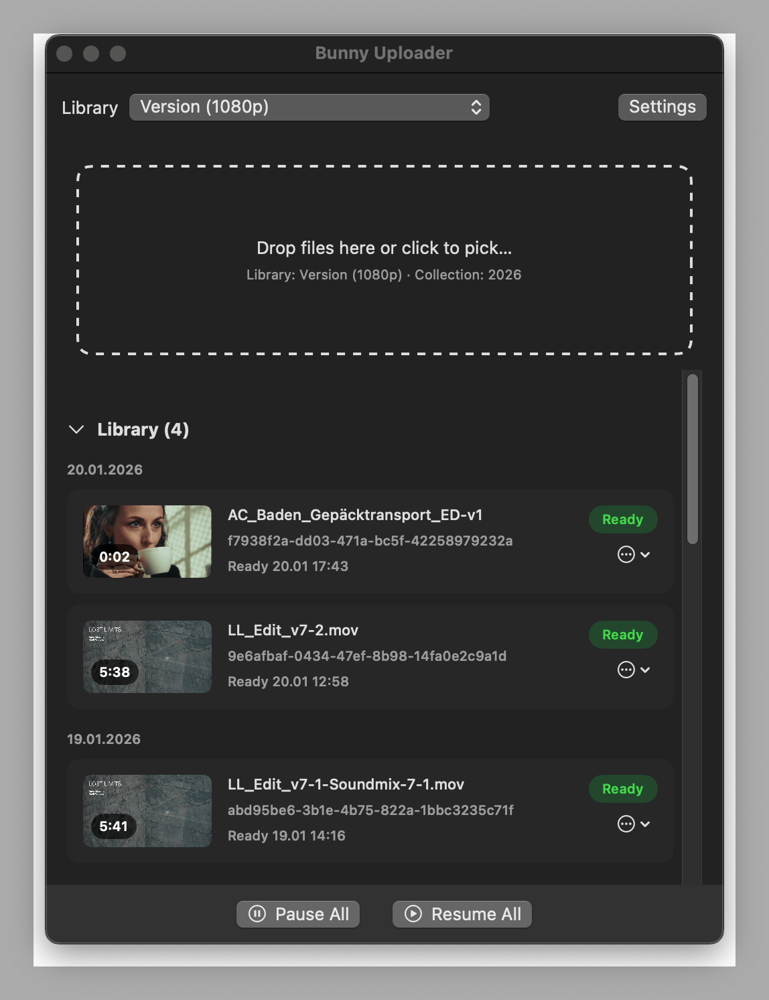
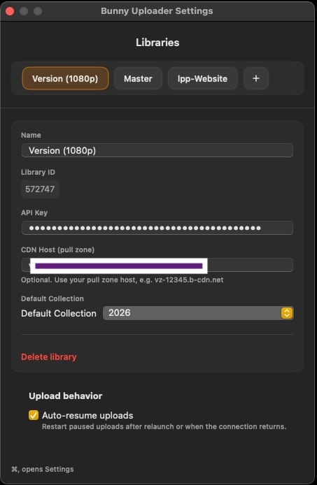

# Bunny Uploader

A simple macOS app for uploading videos to Bunny Stream — with pause/resume, library sync, renaming, and custom thumbnails.

I originally built this for myself after migrating my video production workflow from vimeo to Bunny. It speeds things up because I don’t have to constantly log into the dashboard and wait for it to load. 
It also uses the TUS resumable upload protocol, which is great for unstable or slower networks.

If it’s useful for you too, feel free to use it.

## Screenshots

  
  

## Quick start

### Option A: Download the app (recommended)
Get the latest build from the Releases page:
https://github.com/chprinz/Bunny-Stream-Uploader/releases/

1) Download the **.zip** from the latest release.
2) Unzip it, then drag **Bunny Uploader.app** into **Applications**.
3) Open the app.

#### macOS security note (first launch)
Because this app is distributed outside the Mac App Store, macOS might block it the first time.

Try this first:
- In Finder, right-click **Bunny Uploader.app** → **Open** → **Open**

If it’s still blocked:
- **System Settings → Privacy & Security** → scroll down → **Open Anyway**

### Option B: Build it yourself (for developers)
Scroll down to **For Developers**.

---

## Getting Started

On first launch you’ll add a new Library in the Settings:
- **Library Name** (choose as you like)
- **Library ID** (from Bunny Stream)
- **AccessKey** (Stream API key)
- **CDN Hostname** (Optional, for Thumbnail retrieval)

You can find all those in the Bunny Stream Library Settings > API.

If you want to see the thumbnails in the UI you have to disable "Block direct url file access” in the Bunny Library > Security Settings.

---

## Features
- Drag-and-drop uploads with TUS pause/resume
- Auto-resume on reconnect, and resume after relaunch (upload URL is persisted)
- Library sync (pulls remote videos, dates, thumbnails, status)
- Edit titles, upload thumbnails, copy embed URL
- Delete locally or from Bunny

---

## Upload reliability & resume
- Each upload stores its TUS upload URL and progress in:
  `~/Library/Application Support/BunnyUploader/uploads.json`
  so the app can continue an interrupted transfer without recreating the video.
- A Settings toggle enables auto-resume: paused uploads are moved back to pending on app launch or when the network reconnects; you can still resume/pause items individually.
- Global controls let you pause/resume everything in one click; cancellations clean up the remote video when possible, while leaving successfully uploaded items untouched.
- Keeps your Mac awake during uploads.

---

---

## For Developers (build from source)

### Requirements
- macOS 13+ (tested on macOS 15)
- Xcode 15+
- Bunny Stream AccessKey for each library you want to use

### Setup
1) Clone the repo and open `Bunny Uploader.xcodeproj` in Xcode.
2) Build & run. On first launch, add a Library in Settings with:
   - Name (friendly label)
   - Library ID (from Bunny Stream)
   - AccessKey (Stream API key) — stored in Keychain, not in the repo
3) Optional: set a pull zone host for thumbnails and a default collection.

#### Optional env vars
Set these before launch if you prefer environment-based config:
- `BUNNY_PULLZONE`, `BUNNY_PULL_ZONE`, or `BUNNY_PULLZONE_<LIBRARYID>` for CDN host
- `BUNNY_TOKEN_<LIBRARYID>` for signed thumbnail token

### Building & running (notes)
- Debug logging is guarded by `#if DEBUG` in `Services/APIService.swift`.
- Release build: **Product → Archive**, then export the app (Organizer → Distribute App).